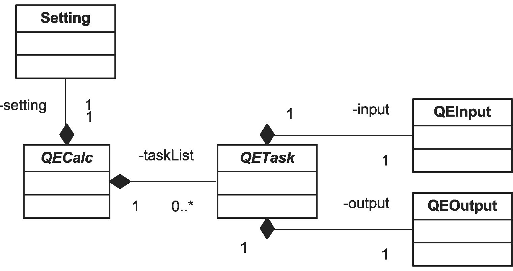
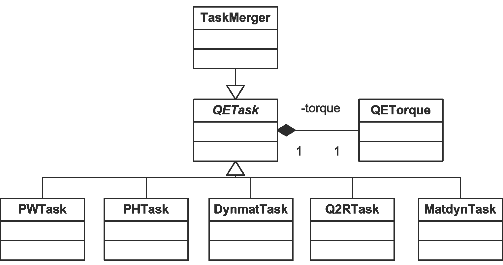
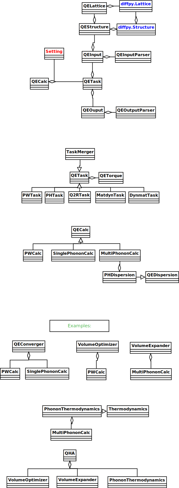

API
===

Class backbone of QECalc
-------------------------

Inheritance diagrams of QECalc family of classes
-------------------------------------------------

.. inheritance-diagram:: qecalc.pwcalc
.. inheritance-diagram:: qecalc.singlephononcalc
.. inheritance-diagram:: qecalc.multiphononcalc

:mod:`qecalc.qecalc`
---------------------------

.. automodule:: qecalc.qecalc
   :members:
   :undoc-members: 
   :show-inheritance:

:mod:`qecalc.pwcalc`
--------------------

.. automodule:: qecalc.pwcalc
   :members:
   :undoc-members:
   :show-inheritance:

:mod:`qecalc.singlephononcalc`
------------------------------

.. automodule:: qecalc.singlephononcalc
   :members:
   :undoc-members:
   :show-inheritance:

:mod:`qecalc.multiphononcalc`
---------------------------------------------

.. automodule:: qecalc.multiphononcalc
   :members:
   :undoc-members:
   :show-inheritance:

.. Here are some examples of class diagrams:

.. Here are some examples of class diagrams:
.. .. class-diagram::

Inheritance diagrams of QETask family of classes
-------------------------------------------------

.. .. inheritance-diagram:: qecalc.qetask.pwtask
.. .. inheritance-diagram:: qecalc.qetask.phtask
.. .. inheritance-diagram:: qecalc.qetask.matdyntask
.. .. inheritance-diagram:: qecalc.qetask.dynmattask
.. .. inheritance-diagram:: qecalc.qetask.matdyntask
.. inheritance-diagram:: qecalc.qetask.pwphmerger

:mod:`qecalc.qetask.qetask`
----------------------------

.. automodule:: qecalc.qetask.qetask
   :members:
   :undoc-members:
   :show-inheritance:

:mod:`qecalc.qetask.taskmerger`
--------------------------------

.. automodule:: qecalc.qetask.taskmerger
   :members:
   :undoc-members:
   :show-inheritance:

Class overview of QECalc
------------------------------

.. todo: don't forget to replace the dataobjects with the current ones

.. todo: this documentation could be put as docstrings and then just autodoc'd here...(see http://sphinx.pocoo.org/ext/autodoc.html)
