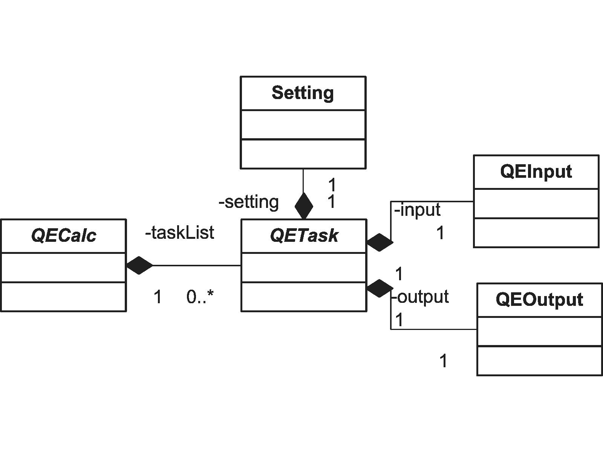
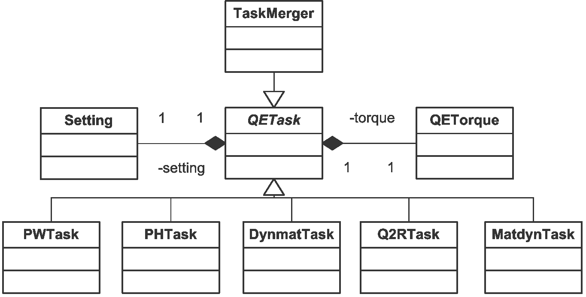

Quick Tutorial
===============

Organization
---------------------

QECalc offers a set of Quantum Espresso calculators, designed for various
purposes. Each Calc is a list of tasks. Each task is executed sequentially
after another on launch of a given Calc:

   *Fig. Class backbone of QECalc*

For example, PWCalc consists of a single task, pw.x and SignlePhononCalc
contains  [pw.x, ph.x, dynmat.x] tasks.

Each task corresponds to an executable from QE package and contains all the
information it needs to launch itself as well as
how to parse its inputs and outputs. New tasks can be easily defined based on
existing patterns. The following diagram addresses the relation between tasks:

   *Fig. QETask family of classes*

Configuration
---------------------
QECalc settings can be provided either through a config file or a config string,
placed into the python script. This configuration contains launching parameters
as well as input/output variables
descriptions relevant to each QE executable. If some parameters are not specified,
default values are used.

Example of a file config.ini (or configString) is provided below::

    [Launcher]
    # parallelization parameters
    # if this section is empty - serial mode is used
    paraPrefix:   mpiexec -n 8
    paraPostfix: -npool 8

    serialPrefix: mpiexec -n 1
    serialPostfix:

    outdir: temp/

    [pw.x]
    pwInput: scf.in
    pwOutput: scf.out

[Launcher] section is common for all tasks (but its variables can be independently modified
for each specific task during the execution). Some tasks are serial, some are
parallel, para/serial variables specify launching parameters for these two classes
of tasks. If serialPrefix is empty, a serial task will be launched on a head node.

Task sections can also contain Quantum Espresso variables, corresponding to input/output
files which are usually  specified in QE config files. For example 'flvec' from matdyn.x config
file  or 'fildyn' from ph.x input file. Any file variable, specified in a section
of config.ini will override one in corresponding QE config file. If none is specified,
QECalc will try to resolve their default values internally, so it will not affect parsing.
For example, default value of 'flvec' is 'matdyn.modes' and it does not have
to be specified neither in matdyn config file nor in config.ini.

if 'outdir' or 'prefix' is specified in config.ini, it will override any prefix or outdir specified
in QE config input files of tasks containing these fields.

One does not have to include all the sections. if a section is omitted, default
values are used.

How to pass the configuration::

    from qecalc.qetask.pwtask import PWTask

    pw = PWTask(filename = 'config.ini')
    # or
    pw = PWTask(configString = configString)

Torque
--------
QECalc can use torque. By default, on each task launch, torque
launcher will wait till the job's completion and check it's exit status.

Example of configuration file using Torque::

    configString = """

    useTorque: True
    paraPrefix: mpirun --mca btl openib,sm,self
    paraPostfix: -npool 900

    serialPrefix: mpirun
    serialPostfix:

    #Name of a script to execute a command on multiple nodes
    #relevant if outdir is not located on Parallel/Network File system.
    #Default value is empty
    paraRemoteShell: bpsh -a

    # this string will be passed to qsub, -d workingDir -V are already there:
    paraTorqueParams: -l nodes=8:ppn=12 -l walltime=999:99:99 -N myjob -o stdout -e stderr
    serialTorqueParams: -l nodes=1:ppn=1 -l walltime=999:99:99 -N myjob -o stdout -e stderr

    # outdir will override  outdir setting in all relevant QE input files
    outdir: /scratch/user/temp/
    
    # pseudo_dir will override  outdir setting in all relevant  QE input files
    pseudo_dir: /user/projects/pslib

    [pw.x]
    pwInput: scf_man.in
    pwOutput: scf_man.out
    """
    from qecalc.qetask.pwtask import PWTask

    pw = PWTask(configString = configString)
    pw.launch()
    print pw.output.property('total energy')
    print pw.output.property('fermi energy')    

Example 1: MultiPhononCalc
----------------------------

MultiPhononCalc consists of [pw.x, ph.x, q2r.x, matdyn.x]
list of tasks. And pw.x and ph.x tasks are 'merged' - they
are submitted as a single job (in order to share one set of outdirs when torque
is used)::

    from qecalc.multiphononcalc import MultiPhononCalc
    mphon = MultiPhononCalc('config.ini')
    mphon.launch()
    #lookupProperty() goes through  all the  output files of a given calc:
    print mphon.lookupProperty('total energy', withUnits = True)
    print mphon.lookupProperty('stress')
    print mphon.lookupProperty('forces', withUnits = True)
    # this will output qpoints, frequencies and eigen modes
    vecs, freqs, qpts = mphon.lookupProperty('multi phonon')

It should be noted, in order to run this example, config.ini, pw.x, ph.x, q2r.x,
and matdyn.x input files should be in the
current dir. config.ini should have additional sections corresponding to
these additional tasks::

    [ph.x]
    #ph.x input/ouput, relevant to all phonon calculations:
    phInput:  ph.in
    phOutput: ph.out

    [dynmat.x]
    #dynmat.x input/output files relevant to single phonon calculation
    dynmatInput:  dynmat.in
    dynmatOutput: dyn.out

    [q2r.x]
    # input/output files relevant to multiple phonon calculation
    q2rInput:      q2r.in
    q2rOutput:     q2r.out

    [matdyn.x]
    # input/output files relevant to multiple phonon calculation
    matdynInput:   matdyn.in
    matdynOutput:  matdyn.out

The following example processes outputs only (assuming outputs are available 
without running the simulation)::

    mphon = MultiPhononCalc(filename = 'config.ini')

    for task in mphon.getAllTasks():
        task.output.parse()
        

Example 2: Converger
----------------------

Class Converger will converge a value  with respect to k-points or
different parameters  of pw.x input file. Currently, the value can be 'total energy',
'fermi energy' or 'single phonon'::

    from qeutils.converger import Converger
    task = Converger(configString = configString, taskName = 'total energy', tolerance = 0.1)
    opt_ecutwfc = task.converge(what = 'ecutwfc', startValue = 18, step = 4)
    opt_kpoints = task.converge(what = 'kpoints', startValue = [12,12,12], step = [2,2,2])    
    opt_conv_thr = task.converge(what = 'conv_thr', startValue = 1e-4, multiply = 0.1)

Example 3: Loops
------------------

For greater flexibility, tasks can be used separately from calcs. Here we will define
a couple of loops using PWTask::

    from qecalc.qetask.pwtask import PWTask

    configString = """
    [Launcher]
    paraPrefix:   mpiexec -n 8
    paraPostfix: -npool 8
    outdir: temp/

    #default value of pwInput is 'scf.in'
    """

    pw = PWTask(configString = configString)
    #parse inputs and sync with Settings:
    pw.syncSetting()
    lat_params = [5.5, 5.6, 5.7]
    for a in lat_params:
        # whole lattice and structure will be auto updated on change in 'a' according
        # to the lattice symmetry (ibrav):
        pw.input.structure.lattice.a = a
        pw.input.save()
        pw.launch()
        print 'Stress = ', pw.output.property('stress')

    ecut_wfc_list = [15, 16, 17.5]
    for ecut_wfc in ecut_wfc_list:
        # if the variable did not exist, it will be created, othervise overwritten
        pw.input.namelist('system').add('ecutwfc', ecut_wfc)
        pw.input.save()
        pw.launch()
        print 'Total Energy = ', pw.output.property('total energy')
        
        
Example 4: Working with structures
-----------------------------------

::

    
    from qecalc.qetask.qeparser.pwinput import PWInput
    
    #initialize pwscf (pw.x) input object from an input file:
    input = PWInput( 'pwscf.in' )
    
    print input    # print input.toString()
    # by default, any change in structure automatically updates input:
    import numpy
    # update fractional coordinates and mass first atom in structure:    
    input.structure[0].xyz = numpy.array([0.5, 0.5, 0.5])
    input.structure[0].mass = 16.0
    print input 

    # another way:

    from qecalc.qetask.qeparser.qestructure import QEStructure

    stru = QEStructure()

    # read structure
    # possible formats are 'pwinput', 'pwoutput', 'bratoms', 'cif', 'discus', 
    # 'pdb', 'pdffit', 'rawxyz', 'xcfg', 'xyz' (note: xyz does no have lattice info) 
    stru.read(filename = 'PbTe.cif', format = 'cif')
    
    # write to string:
    print stru.writeStr(format = 'pdb')
    
    # generate pwscf template from structure: 
    print stru.writeStr(format = 'pwinput')
    
    stru.write(filename = 'scf.in', format = 'pwinput')
    
    for atom in stru:
        print atom

    print stru
    
