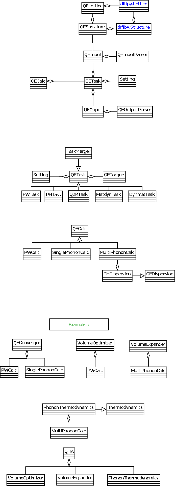

Tutorial
========

QECalc is a set of Quantum Espresso launchers and input/ouput parsers.
It's primary goal is to use its classes, such as QECalc, QEPhon, to
create batch jobs. One such example can be class Converger from qecalc/converger.py wich can be  used to converge such
properties as 'total energy', 'geometry', and 'single phonon' with respect to
cut off energies and number of k-points. More examples can be seen in examples
directory.

Currently, to use the module one needs to create a python
file (example is main.py) and edit it according to the task desired,
provided the 'qecalc' folder is in PYTHONPATH. It depends on diffpy.Structure
module, which can be obtained through easy_install. One also needs to provide
all the appropriate config files for Quantum Espresso (scf.in for total
energy or geometry optimization; scf.in, ph.in; dynmat.in for
phonons; additionally q2r.in and matdyn.in for multiphonons) and place config.ini
into working dir. An example of config.ini is located in qecalc directory. All
its sections do not need to be populated, only the parameters needed for a
specific task. If some of the parameters are missing, default values will be used.

For now, QE config files should have one variable per line and no
comments. Also make sure that cards arguments from pwscf input file do not
have brackets around them

Before the run, check all the pseudopotentials from the config file
are available and all the directories are created (e.g. temp/ ) and
Quantum Espresso is in your PATH. See also example directory

Here is a large overview:

.. todo: don't forget to replace the dataobjects with the current ones

To use the qecalc bindings for electronic structure, simply import them::

from qecalc import QECalc

or for phonons::

from qephon import QEPhon
mphon = QEPhon('config.ini')

For the following postprocessing routines to work, it is assumed all the input/output files exist.

.. todo: this documentation could be put as docstrings and then just autodoc'd here...(see http://sphinx.pocoo.org/ext/autodoc.html)

.. automodule qecalc.qecalc
	:members:
	:undoc-members:
	:inherited-members:

qecalc/property.py:

getTotalEnergy()
getSinglePhonon()  Freqs in meV
getLatticeParameters()
        """Extract lattice parameters after pwscf geometry optimization
           Returns a list of 6 parameters: A, B, C, cos(BC), cos(AC), cos(AB)"""
getStress()  in kbar
getForces() in Ry/au

qecalc/launchers:
quite Self explanatory

qecalc/qecalc.py:

kMeshCart(nq1, nq2, nq3) - Will generate k-point mesh in Cartesian coordinates
Lattice symmetry is not taken into account. Is not useful unless matdyn
parser is written

These methods are questionable to be public:

getkPointsFromPWSCF() - Returns array of points. Does not have to be AUTOMATIC

setkPointsAutomatic(kpoints) - kpoints is a list [nkx, nky, nkz, 1|0, 1|0, 1|0]
getEkincutoff() - reads kinetic energy cutoff

qecalc/qephon:

Most useful for now:
DOS() and partDOS('atomSymbol')
It is assumed, proper 'matdyn.modes' file was already generated by matdyn.x
list of atom symbols can be obtained from qe.structure.atomicSpecies[:].element
See qephon_ex.py example in examples/qephon directory

Here are some examples of inheritance diagrams:

.. .. inheritance_diagram:: qecalc.qecalc

Here are some examples of class diagrams:

.. .. class_diagram::